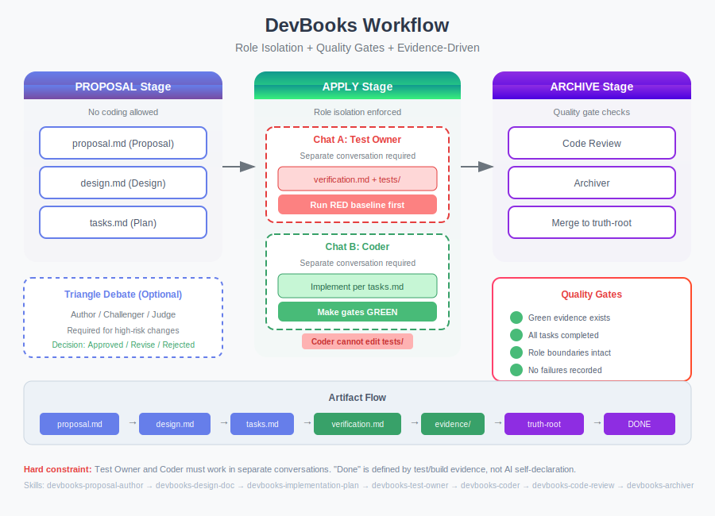

# DevBooks

**An agentic AI development workflow for Claude Code / Codex CLI**

> Turn large changes into a controlled, traceable, verifiable loop: Skills + quality gates + role isolation.

[](https://www.npmjs.com/package/dev-playbooks)
[](../LICENSE)



---

## Why DevBooks?

AI coding assistants are powerful, but often **unpredictable**:

| Pain point | Outcome |
|------|------|
| **AI self-declares "done"** | Tests fail, edge cases are missed |
| **Writing tests and code in the same chat** | Tests turn into “pass tests” instead of spec verification |
| **No verification gates** | False completion silently ships |
| **Only works for greenfield (0→1)** | Brownfield repos have no on-ramp |
| **Too few commands** | Complex changes are not just "spec/apply/archive" |

**DevBooks provides**:
- **Evidence-based done**: completion is defined by tests/build/evidence, not AI self-evaluation
- **Enforced role isolation**: Test Owner and Coder must work in separate conversations
- **Multiple quality gates**: green evidence checks, task completion, role boundary checks
- **18 Skills**: proposal, design, review, entropy metrics, and full workflow coverage

---

## How It Works

**Hard constraint**: Test Owner and Coder **must work in separate conversations**. This is not a suggestion. Coder cannot modify `tests/**`. "Done" is defined by tests/build verification, not AI self-evaluation.

---

## Quick Start

### Supported AI tools

| Tool | Support Level | Config File |
|------|---------------|-------------|
| **Claude Code** | Full Skills | `CLAUDE.md` |
| **Codex CLI** | Full Skills | `AGENTS.md` |
| **Qoder** | Full Skills | `AGENTS.md` |
| **OpenCode (oh-my-opencode)** | Full Skills | `AGENTS.md` |
| **Cursor** | Rules | `.cursor/rules/` |
| **Windsurf** | Rules | `.windsurf/rules/` |
| **Gemini CLI** | Rules | `GEMINI.md` |
| **Continue** | Rules | `.continue/rules/` |
| **GitHub Copilot** | Instructions | `.github/copilot-instructions.md` |

> **Tip**: Use natural language to invoke skills, e.g., "Run devbooks-proposal-author skill to create a proposal for adding OAuth2 authentication"

### Install & init

**Install via npm (recommended):**

```bash
# global install
npm install -g dev-playbooks

# init inside your project
dev-playbooks init
```

**One-off usage:**

```bash
npx dev-playbooks@latest init
```

**From source (contributors):**

```bash
../scripts/install-skills.sh
```

### Install targets

After initialization:
- Claude Code: `~/.claude/skills/devbooks-*`
- Codex CLI: `~/.codex/skills/devbooks-*`
- Qoder: `~/.qoder/` (manual setup required)
- OpenCode: `~/.config/opencode/skill/devbooks-*`

### Quick integration

DevBooks uses two directory roots:

| Directory | Purpose | Default |
|------|------|--------|
| `<truth-root>` | Current specs (read-only truth) | `dev-playbooks/specs/` |
| `<change-root>` | Change packages (workspace) | `dev-playbooks/changes/` |

See `docs/devbooks-setup-guide.md`, or use the "Quick Start" prompt in that guide to let your assistant configure it automatically.

---

## Day-to-Day Change Workflow

### Use Router (recommended)

```
Run devbooks-router skill: <your request>
```

Router analyzes your request and outputs an execution plan (which skill to run next).

### Direct skill invocation

Once you know the flow, call the Skills directly:

**1) Proposal stage (no coding)**

```
Run devbooks-proposal-author skill to create a proposal: Add OAuth2 user authentication
```

Artifacts: `proposal.md` (required), `design.md`, `tasks.md`

**2) Apply stage (role isolation enforced)**

You must use **two separate conversations**:

```
# Chat A - Test Owner
Run devbooks-test-owner skill for change add-oauth2

# Chat B - Coder
Run devbooks-coder skill for change add-oauth2
```

- Test Owner: writes `verification.md` + tests, runs **Red** first
- Coder: implements per `tasks.md`, makes gates **Green** (cannot modify tests)

**3) Review stage**

```
Run devbooks-reviewer skill for change add-oauth2
```

**4) Archive stage**

```
Run devbooks-archiver skill for change add-oauth2
```

---

## Skills Reference

### Proposal stage

| Skill | Description |
|-------|-------------|
| devbooks-router | Route to the right Skill |
| devbooks-proposal-author | Create a change proposal |
| devbooks-impact-analysis | Cross-module impact analysis |
| devbooks-proposal-challenger | Challenge a proposal |
| devbooks-proposal-judge | Adjudicate a proposal |
| devbooks-design-doc | Create a design doc |
| devbooks-spec-contract | Define specs & contracts |
| devbooks-implementation-plan | Create an implementation plan |

### Apply stage

| Skill | Description |
|-------|-------------|
| devbooks-test-owner | Test Owner role (separate chat required) |
| devbooks-coder | Coder role (separate chat required) |
| devbooks-design-backport | Backport discoveries to design |

### Review stage

| Skill | Description |
|-------|-------------|
| devbooks-reviewer | Code review (readability/consistency) |
| devbooks-test-reviewer | Test quality and coverage review |

### Archive stage

| Skill | Description |
|-------|-------------|
| devbooks-archiver | Maintain/dedupe specs |
| devbooks-delivery-workflow | End-to-end delivery workflow |

### Standalone Skills

| Skill | Description |
|-------|-------------|
| devbooks-entropy-monitor | System entropy metrics |
| devbooks-brownfield-bootstrap | Brownfield project bootstrap |

---

## DevBooks Comparisons

### vs. OpenSpec

[OpenSpec](https://github.com/Fission-AI/OpenSpec) is a lightweight spec-driven framework with three core commands (proposal/apply/archive), organizing changes by feature folders.

**OpenSpec limitations:**
- No role isolation between test writing and implementation
- No quality gates to block false completion
- Only 3 commands (proposal/apply/archive)

**DevBooks solves these with:**
- Hard boundary between Test Owner and Coder (separate chats)
- 5+ verification gates to block false completion
- 18 Skills for complete workflow coverage
- Evidence-based done: tests/build define "done", not self-evaluation

### vs. spec-kit

[GitHub spec-kit](https://github.com/github/spec-kit) is a spec-driven toolkit with a constitution file, multi-step refinement, and structured planning.

**spec-kit limitations:**
- Primarily designed for greenfield projects
- No runtime verification gates
- No brownfield project support

**DevBooks solves these with:**
- Brownfield-first: generates baseline specs for existing repos
- Role isolation: test authoring and implementation are separated
- Quality gates: runtime verification, not just workflow guidance
- Prototype mode: safe experiments without polluting main `src/`

### vs. Kiro.dev

[Kiro](https://kiro.dev/) is an AWS agentic IDE with a three-phase workflow (EARS requirements, design, tasks), but stores specs separately from implementation artifacts.

**Kiro limitations:**
- Stores specs separately from implementation artifacts
- No role isolation between Test Owner and Coder
- Task completion as the only verification

**DevBooks solves these with:**
- Change package: proposal/design/spec/plan/verification/evidence in one place for lifecycle traceability
- Role isolation: Test Owner and Coder are separated
- Quality gates: verified through gates, not just task completion

### vs. no spec

Without specs, the assistant generates code from vague prompts, leading to unpredictable output, scope creep, and “hallucinated completion”.

**DevBooks brings:**
- Specs agreed before implementation
- Quality gates that verify real completion
- Role isolation to prevent self-verification
- Evidence chain per change

---

## Core Principles

| Principle | Meaning |
|------|------|
| **Protocol first** | truth/change/archive live in the repo, not only in chat logs |
| **Anchor first** | done is defined by tests/static checks/build/evidence |
| **Role isolation** | Test Owner and Coder must work in separate conversations |
| **Truth root separation** | `<truth-root>` is read-only truth; `<change-root>` is the workspace |
| **Structural gates** | prioritize complexity/coupling/test quality, not proxy metrics |

---

## Advanced Features

<details>
<summary><strong>Quality gates</strong></summary>

DevBooks uses quality gates to block “false done”:

| Gate | Trigger mode | What it checks |
|------|----------|----------|
| Green evidence | archive, strict | `evidence/green-final/` exists and is non-empty |
| Task completion | strict | all tasks are done or SKIP-APPROVED |
| Test failure block | archive, strict | no failures in green evidence |
| P0 skip approval | strict | P0 skips require an approval record |
| Role boundary | apply --role | Coder cannot modify tests/, Test Owner cannot modify src/ |

Core scripts (in `../skills/devbooks-delivery-workflow/scripts/`):
- `change-check.sh --mode proposal|apply|archive|strict`
- `handoff-check.sh` - handoff boundary checks
- `audit-scope.sh` - full audit scan
- `progress-dashboard.sh` - progress visualization

</details>

<details>
<summary><strong>Prototype mode</strong></summary>

When the technical approach is uncertain:

1. Create a prototype: `change-scaffold.sh <change-id> --prototype`
2. Test Owner with `--prototype`: characterization tests (no Red baseline required)
3. Coder with `--prototype`: output to `prototype/src/` (isolates main src)
4. Promote or discard: `prototype-promote.sh <change-id>`

Prototype mode prevents experimental code from polluting the main tree.

Scripts live in `../skills/devbooks-delivery-workflow/scripts/`.

</details>

<details>
<summary><strong>Entropy monitoring</strong></summary>

DevBooks tracks four dimensions of system entropy:

| Metric | What it measures |
|------|----------|
| Structural entropy | module complexity and coupling |
| Change entropy | change patterns and volatility |
| Test entropy | coverage/quality decay over time |
| Dependency entropy | external dependency health |

Use `devbooks-entropy-monitor` skill to generate reports and identify refactor opportunities.

Scripts (in `../skills/devbooks-entropy-monitor/scripts/`): `entropy-measure.sh`, `entropy-report.sh`

</details>

<details>
<summary><strong>Brownfield project bootstrap</strong></summary>

When `<truth-root>` is empty:

```
Run devbooks-brownfield-bootstrap skill
```

Generates:
- project profile and glossary
- baseline specs from existing code
- minimal verification anchors
- module dependency map
- technical debt hotspots

</details>

<details>
<summary><strong>MCP auto-detection</strong></summary>

DevBooks Skills support graceful MCP (Model Context Protocol) degradation: you can run the full workflow without MCP/CKB; when CKB (Code Knowledge Base) is detected, DevBooks automatically enables graph-based capabilities for more accurate “scope/reference/call chain” analysis.

### What is it for?

- **More accurate impact analysis**: upgrades from “file-level guesses” to “symbol references + call graphs”
- **More focused reviews**: automatically pulls hotspots and prioritizes high-risk areas (tech debt/high churn)
- **Less manual grep**: reduces noise and repeated confirmation in large repos

### MCP status and behavior

| MCP status | Behavior |
|----------|------|
| CKB available | Enhanced mode: symbol-level impact/references/call graph/hotspots (`mcp__ckb__analyzeImpact`, `mcp__ckb__findReferences`, `mcp__ckb__getCallGraph`, `mcp__ckb__getHotspots`) |
| CKB unavailable | Basic mode: Grep + Glob text search (full functionality, lower precision) |

### Auto detection

- Skills that depend on MCP call `mcp__ckb__getStatus` first (2s timeout)
- Timeout/failure → silently falls back to basic mode (non-blocking)
- No manual “basic/enhanced” switch required

To enable enhanced mode: configure CKB per `docs/Recommended-MCP.md` and manually generate `index.scip`.

</details>

<details>
<summary><strong>Proposal review workflow</strong></summary>

For strict proposal review, use the three-role workflow (each role in a separate conversation):

1. **Author** (`devbooks-proposal-author`): creates the proposal
2. **Challenger** (`devbooks-proposal-challenger`): challenges assumptions, finds gaps, identifies risks
3. **Judge** (`devbooks-proposal-judge`): makes the final decision and records rationale

Decision: `Approved`, `Revise`, `Rejected`

</details>

---

## Migration from Other Frameworks

DevBooks provides migration scripts to help you transition from other spec-driven development tools.

### Migrate from OpenSpec

If you're currently using [OpenSpec](https://github.com/Fission-AI/OpenSpec) with an `openspec/` directory:

```bash
# Using CLI (recommended)
dev-playbooks migrate --from openspec

# Preview changes first
dev-playbooks migrate --from openspec --dry-run

# Keep original directory after migration
dev-playbooks migrate --from openspec --keep-old
```

**What gets migrated:**
- `openspec/specs/` → `dev-playbooks/specs/`
- `openspec/changes/` → `dev-playbooks/changes/`
- `openspec/project.md` → `dev-playbooks/project.md`
- All path references are automatically updated
- AI tool command directories are cleaned up (`.claude/commands/openspec/`, etc.)

### Migrate from GitHub spec-kit

If you're using [GitHub spec-kit](https://github.com/github/spec-kit) with `specs/` and `memory/` directories:

```bash
# Using CLI (recommended)
dev-playbooks migrate --from speckit

# Preview changes first
dev-playbooks migrate --from speckit --dry-run

# Keep original directories after migration
dev-playbooks migrate --from speckit --keep-old
```

**Mapping rules:**

| Spec-Kit | DevBooks |
|----------|----------|
| `memory/constitution.md` | `dev-playbooks/specs/_meta/constitution.md` |
| `specs/[feature]/spec.md` | `changes/[feature]/design.md` |
| `specs/[feature]/plan.md` | `changes/[feature]/proposal.md` |
| `specs/[feature]/tasks.md` | `changes/[feature]/tasks.md` |
| `specs/[feature]/quickstart.md` | `changes/[feature]/verification.md` |
| `specs/[feature]/contracts/` | `changes/[feature]/specs/` |

### Migration Features

Both migration scripts support:

- **Idempotent execution**: Safe to run multiple times
- **Checkpoints**: Resume from where you left off if interrupted
- **Dry-run mode**: Preview changes before applying
- **Automatic backup**: Original files are backed up to `.devbooks/backup/`
- **Reference updates**: Path references in documents are automatically updated

### Post-Migration Steps

After migration:

1. Run `dev-playbooks init` to set up DevBooks Skills
2. Review migrated files in `dev-playbooks/`
3. Update `verification.md` files with proper AC mappings
4. Run `devbooks-brownfield-bootstrap` skill if you need baseline specs

---

## Directory Structure

```
dev-playbooks/
├── README.md              # This document
├── constitution.md        # Project constitution (GIP principles)
├── project.md             # Project context (tech stack/conventions)
├── specs/                 # Current specs (read-only truth)
│   ├── _meta/             # Metadata (glossary, project profile)
│   └── architecture/      # Architecture specs (fitness-rules)
├── changes/               # Change packages (workspace)
├── scripts/               # Helper scripts
└── docs/                  # Documentation
    ├── devbooks-setup-guide.md   # Configuration guide
    ├── workflow-diagram.svg      # Workflow visualization
    └── Recommended-MCP.md        # MCP configuration
```

---

## Documentation

- [Setup guide](docs/devbooks-setup-guide.md)
- [MCP configuration recommendations](docs/Recommended-MCP.md)

---

## License

MIT
